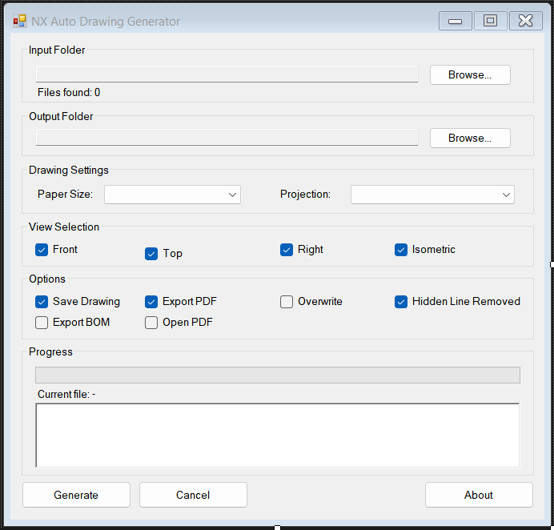

# NXOpen 2D Drawing Generator

  <strong>Automated Batch 2D Drawing & PDF Generation using Siemens NXOpen API</strong>
</p>

---

## 📌 Overview

The **NXOpen 2D Drawing Generator** is a Windows Forms desktop application developed using **C#** and the **Siemens NXOpen API** to automate the generation of **2D engineering drawings** from Siemens NX `.prt` files.

The application eliminates repetitive manual drafting by automatically creating standard drawing sheets, generating orthographic and isometric views, and exporting high-quality PDF drawings. It supports **batch processing**, enabling engineers to process multiple part files in a single operation while maintaining consistent drawing standards.

---

## ✨ Features

- Batch processing of multiple `.prt` files
- Automatic 2D drawing creation
- Automatic PDF export
- Front, Top, Right & Isometric view generation
- Configurable paper size (A4, A3, A2, A1)
- First Angle / Third Angle projection
- Save generated drawings
- Hidden Line Removal option
- Progress tracking
- Error handling and logging
- Assembly detection (Skip assemblies)

---

## 🖥 User Interface

<p align="center">
  
</p>

The application provides a simple and intuitive interface for selecting input/output folders, configuring drawing settings, monitoring progress, and generating engineering drawings with a single click.

---

## 🚀 Workflow

```text
Select Input Folder
        │
        ▼
Scan all .prt files
        │
        ▼
Open Part
        │
        ▼
Create Drawing Sheet
        │
        ▼
Generate Standard Views
        │
        ▼
Save Drawing
        │
        ▼
Export PDF
        │
        ▼
Close Part
        │
        ▼
Process Next Part
```

---

## ⚙ Technologies Used

| Technology | Purpose |
|------------|---------|
| C# | Application Development |
| Windows Forms | Desktop User Interface |
| Siemens NXOpen API | CAD Automation |
| NXOpen Drafting | Drawing Generation |
| NXOpen PDF Builder | PDF Export |
| .NET Framework | Runtime |

---

## 📂 Project Structure

```
NXOpen2DDrawingGenerator
│
├── MainForm.cs
├── Program.cs
│
├── Models
│   ├── DrawingGenerationRequest.cs
│   └── PartProcessResult.cs
│
├── NX
│   ├── DrawingGenerator.cs
│   └── PdfExporter.cs
│
├── Helpers
│   └── FileHelper.cs
│
└── Resources
```

---

## 📋 Drawing Generation Process

For every part file, the application performs the following operations automatically:

1. Open NX Part (`.prt`)
2. Enter Drafting Environment
3. Create Drawing Sheet
4. Generate Front View
5. Generate Top View
6. Generate Right View
7. Generate Isometric View
8. Save Drawing
9. Export PDF
10. Close Part

---

## 📈 Current Capabilities

- Batch drawing generation
- PDF export
- Standard view creation
- Drawing sheet creation
- Progress monitoring
- Assembly detection
- User-configurable drawing settings

---

## 🚧 Future Enhancements

- Intelligent View Scaling
- Dynamic View Placement
- Automatic Dimensioning
- Hole Callouts
- Section Views
- Detail Views
- DXF Export
- BOM Export
- Multi-sheet Drawings
- Title Block Automation
- GD&T Support

---

## 🎯 Benefits

- Reduces manual drafting effort
- Speeds up engineering documentation
- Standardizes drawing layouts
- Improves productivity
- Enables batch processing
- Generates consistent manufacturing drawings

---

## 📸 Sample Output

*(Add screenshots of generated PDFs here)*

```
images/
    sample1.png
    sample2.png
    sample3.png
```

---

## 👨‍💻 Author

**Shubham Gagare**

Mechanical Engineer | Siemens NX | NXOpen | CAD Automation | C# | Manufacturing Automation

---

## ⭐ If you found this project useful, consider giving it a star!
